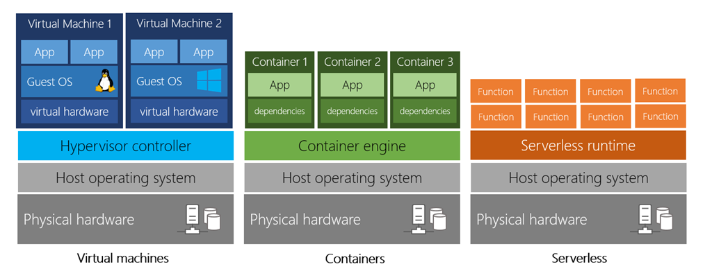
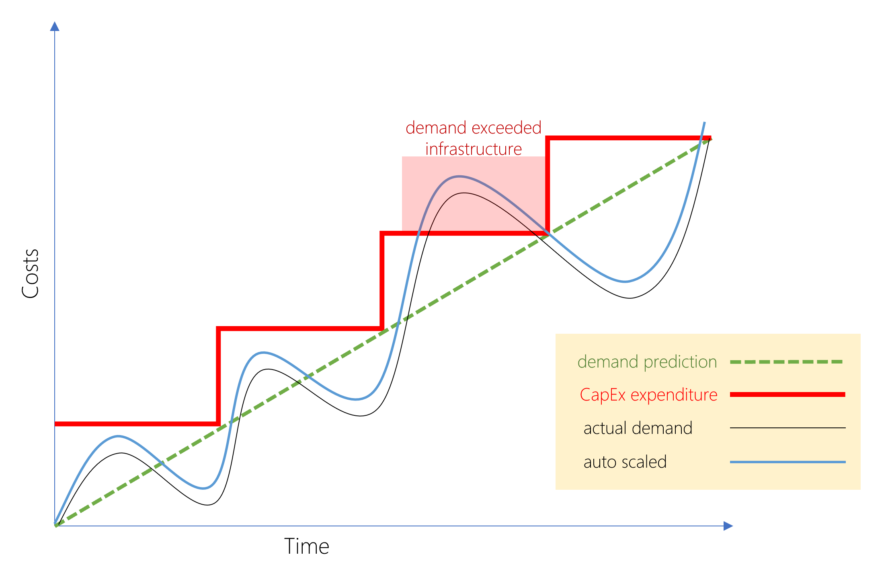

# Cloud Concepts - Principles of cloud computing
## Intro [^1]

The process of turning on a light is hidden behind the simple act of flipping a switch. At this point, electricity becomes a utility, which has many benefits. First, you only pay for what you need. When you buy a light bulb, you don't pay your electricity provider up front for how long you could possibly use it. Instead, you pay for the amount of electricity that you actually use. Second, you don't worry about how or when power plants upgrade to the latest technology. Finally, you don't have to manage scaling the electricity. For example, as people move to your town, you can rest assured that your light will stay on.

As a technology professional, it would be nice to have these same benefits when developing and deploying applications. Storing data, streaming video, or even hosting a website all require managing hardware and software. This management is an unnecessary obstacle when delivering your application to your users. Luckily there is a solution to this problem: cloud computing.

## What is cloud computing?[^2]

The cloud provider is responsible for the physical hardware required to execute your work, and for keeping it up-to-date. The computing services offered tend to vary by cloud provider. However, typically they include:

	
- __Compute power__ - such as Linux servers or web applications
- __Storage__ - such as files and databases
- __Networking__ - such as secure connections between the cloud provider and your company
- __Analytics__ - such as visualizing telemetry and performance data

### Cloud computing services
#### Compute Power

VMs aren't the only computing choice - there are two other popular options: containers and serverless computing.

__Containers__ provide a consistent, isolated execution environment for applications. They're similar to VMs except they don't require a guest operating system. Instead, the application and all its dependencies is packaged into a "container" and then a standard runtime environment is used to execute the app. This allows the container to start up in just a few seconds, because there's no OS to boot and initialize. You only need the app to launch.

The open-source project, Docker, is one of the leading platforms for managing containers. 

__Serverless computing__ lets you run application code without creating, configuring, or maintaining a server. The core idea is that your application is broken into separate functions that run when triggered by some action. This is ideal for automated tasks - for example, you can build a serverless process that automatically sends an email confirmation after a customer makes an online purchase.

#### Storage

Cloud providers typically offer services that can handle all of these types of data. For example, if you wanted to store text or a movie clip, you could use a file on disk. If you had a set of relationships such as an address book, you could take a more structured approach like using a database.

The advantage to using cloud-based data storage is you can scale to meet your needs. If you find that you need more space to store your movie clips, you can pay a little more and add to your available space. In some cases, the storage can even expand and contract automatically - so you pay for exactly what you need at any given point in time.

### Summary

Every business has different needs and requirements. Cloud computing is flexible and cost-efficient, which can be beneficial to every business, whether it's a small start-up or a large enterprise.

## Benefits of cloud computing[^3]

Cloud computing isn't an all-or-nothing service approach. 

### It's cost-effective

Cloud computing provides a pay-as-you-go or consumption-based pricing model.

You can increase or decrease the resources and services used based on the demand or workload at any given time. Cloud computing supports both vertical and horizontal scaling depending on your needs.

__Vertical scaling__, also known as "scaling up", is the process of adding resources to increase the power of an existing server. Some examples of vertical scaling are: adding more CPUs, or adding more memory.

__Horizontal scaling__, also known as "scaling out", is the process of adding more servers that function together as one unit. For example, you have more than one server processing incoming requests.

### It's elastic

As your workload changes due to a spike or drop in demand, a cloud computing system can compensate by automatically adding or removing resources.

### It's current

When you use the cloud, you're able to focus on what matters: building and deploying applications. Cloud usage eliminates the burdens of maintaining software patches, hardware setup, upgrades, and other IT management tasks.

### It's reliable

When you're running a business, you want to be confident your data is always going to be there. Cloud computing providers offer data backup, disaster recovery, and data replication services to make sure your data is always safe. In addition, redundancy is often built into cloud services architecture so if one component fails, a backup component takes its place. This is referred to as fault tolerance and it ensures that your customers aren't impacted when a disaster occurs.

### It's global

Cloud providers have fully redundant datacenters located in various regions all over the globe. This gives you a local presence close to your customers to give them the best response time possible no matter where in the world they are.

### It's secure

Cloud providers offer a broad set of policies, technologies, controls, and expert technical skills that can provide better security than most organizations can otherwise achieve. The result is strengthened security, which helps to protect data, apps, and infrastructure from potential threats.

### Summary

Cloud computing makes running a business easier. It's cost-effective, scalable, elastic, current, reliable, and secure. This means you're able to spend more time on what matters and less time managing the underlying details.

## Compliance terms and requirements[^4]

When selecting a cloud provider to host your solutions, you should understand how that provider can help you comply with regulations and standards

### Compliance Offerings

- Criminal Justice Information Services (CJIS).

- Cloud Security Alliance (CSA) STAR Certification.

- General Data Protection Regulation (GDPR).

- EU Model Clauses.

- Health Insurance Portability and Accountability Act (HIPAA).

- International Organization for Standardization (ISO) and the International Electrotechnical Commission (IEC) 27018.

- Multi-Tier Cloud Security (MTCS) Singapore.

- Microsoft was the first global cloud solution provider (CSP) to receive this certification across all three classifications.

- Service Organization Controls (SOC) 1, 2, and 3.

- National Institute of Standards and Technology (NIST) Cybersecurity Framework (CSF). NIST CSF is a voluntary Framework that consists of standards, guidelines, and best practices to manage cybersecurity-related risks. 

- UK Government G-Cloud.

## Economies of scale[^5]

Economies of scale is the ability to do things more efficiently or at a lower-cost per unit when operating at a larger scale. This cost advantage is an important benefit in cloud computing.

## Capital expenditure (CapEx) versus operational expenditure (OpEx)[^6]

In the past, companies needed to acquire physical premises and infrastructure to start their business. There was a substantial up-front cost in hardware and infrastructure to start or grow a business. Cloud computing provides services to customers without significant upfront costs or equipment setup time.

These two approaches to investment are referred to as:

- __Capital Expenditure (CapEx)__: CapEx is the spending of money on physical infrastructure up front, and then deducting that expense from your tax bill over time. CapEx is an upfront cost, which has a value that reduces over time.

- __Operational Expenditure (OpEx)__: OpEx is spending money on services or products now and being billed for them now. You can deduct this expense from your tax bill in the same year. There's no upfront cost. You pay for a service or product as you use it.

### CapEx computing costs

A typical on-premises datacenter includes costs such as:

- Server costs
- Storage costs
- Network costs
- Backup and archive costs
- Organization continuity and disaster recovery costs
- Datacenter infrastructure costs
- Technical personnel

### OpEx cloud computing costs

With cloud computing, many of the costs associated with an on-premises datacenter are shifted to the service provider. Instead of thinking about physical hardware and datacenter costs, cloud computing has a different set of costs. For accounting purposes, all these costs are operational expenses:

- Leasing software and customized features
- Scaling charges based on usage/demand instead of fixed hardware or capacity.
- Billing at the user or organization level.

### Benefits of CapEx

With capital expenditures, you plan your expenses at the start of a project or budget period. Your costs are fixed, meaning you know exactly how much is being spent. This is appealing when you need to predict the expenses before a project starts due to a limited budget.

### Benefits of OpEx

Demand and growth can be unpredictable and can outpace expectation, which is a challenge for the CapEx model as shown in the following graph.

OpEx is particularly appealing if the demand fluctuates or is unknown. Cloud services are often said to be agile. Cloud agility is the ability to rapidly change an IT infrastructure to adapt to the evolving needs of the business. For example, if your service peaks one month, you can scale to demand and pay a larger bill for the month. If the following month the demand drops, you can reduce the used resources and be charged less. This agility lets you manage your costs dynamically, optimizing spending as requirements change.

## Cloud deployment models[^7]

There are three different cloud deployment models. A cloud deployment model defines where your data is stored and how your customers interact with it – how do they get to it, and where do the applications run? It also depends on how much of your own infrastructure you want or need to manage.

- Public cloud
	+ Advantages
		* High scalability/agility – you don't have to buy a new server in order to scale
		* Pay-as-you-go pricing – you pay only for what you use, no CapEx costs
		* You're not responsible for maintenance or updates of the hardware
		* Minimal technical knowledge to set up and use - you can leverage the skills and expertise of the cloud provider to ensure workloads are secure, safe, and highly available
	+ Disadvantages
    	* There may be specific security requirements that cannot be met by using public cloud
    	* There may be government policies, industry standards, or legal requirements which public clouds cannot meet
    	* You don't own the hardware or services and cannot manage them as you may want to
    	* Unique business requirements, such as having to maintain a legacy application might be hard to meet

- Private cloud
	+ In a private cloud, you create a cloud environment in your own datacenter and provide self-service access to compute resources to users in your organization. This offers a simulation of a public cloud to your users, but you remain completely responsible for the purchase and maintenance of the hardware and software services you provide.
- Hybrid cloud

Cloud computing is flexible and gives you the ability to choose how you want to deploy it. The cloud deployment model you choose depends on your budget, and on your security, scalability, and maintenance needs.

## Types of cloud services[^8]

When talking about cloud computing, there are three major categories. It's important to understand them because they are used in conversation, documentation, and training.

### Explore the three categories of cloud computing
#### Infrastructure as a service (IaaS)

Infrastructure as a Service is the most flexible category of cloud services. It aims to give you the most control over the provided hardware that runs your application (IT infrastructure servers and virtual machines (VMs), storage, and operating systems). Instead of buying hardware, with IaaS, you rent it. It's an instant computing infrastructure, provisioned and managed over the internet.

- Migrating workloads. 
- Test and development
- Storage, backup, and recovery. 

#### Platform as a service (PaaS)

PaaS provides an environment for building, testing, and deploying software applications. The goal of PaaS is to help you create an application quickly without managing the underlying infrastructure. For example, when deploying a web application using PaaS, you don't have to install an operating system, web server, or even system updates.

- Development framework
- Analytics or business intelligence

#### Software as a service (SaaS)

SaaS is software that is centrally hosted and managed for the end customer. It is usually based on an architecture where one version of the application is used for all customers, and licensed through a monthly or annual subscription. Office 365, Skype, and Dynamics CRM Online are perfect examples of SaaS software.

### Cost and Ownership

|                          | IaaS                                                                                                                                                                     | PaaS                                                                                                                                                                                                                                                                                               | SaaS                                                                                                                  |
|--------------------------|--------------------------------------------------------------------------------------------------------------------------------------------------------------------------|----------------------------------------------------------------------------------------------------------------------------------------------------------------------------------------------------------------------------------------------------------------------------------------------------|-----------------------------------------------------------------------------------------------------------------------|
| Upfront costs            | There are no upfront costs. Users pay only for what they consume.                                                                                                        | There are no upfront costs. Users pay only for what they consume.                                                                                                                                                                                                                                  | Users have no upfront costs; they pay a subscription, typically on a monthly or annual basis.                         |
| User ownership           | The user is responsible for the purchase, installation,  configuration, and management of their own software, operating systems,  middleware, and applications.          | The user is responsible for the development of their own  applications. However, they are not responsible for managing the server  or infrastructure. This allows the user to focus on the application or  workload they want to run.                                                              | Users just use the application software; they are not responsible for any maintenance or management of that software. |
| Cloud provider ownership | The cloud provider is responsible for ensuring that the underlying  cloud infrastructure (such as virtual machines, storage, and networking)  is available for the user. | The cloud provider is responsible for operating system management,  network, and service configuration. Cloud providers are typically  responsible for everything apart from the application that a user wants  to run. They provide a complete managed platform on which to run the  application. |                                                                                                                       |

### Management responsibilities

[^1]: https://docs.microsoft.com/en-us/learn/modules/principles-cloud-computing/1-introduction
[^2]: https://docs.microsoft.com/en-us/learn/modules/principles-cloud-computing/2-what-is-cloud-computing
[^3]: https://docs.microsoft.com/en-us/learn/modules/principles-cloud-computing/3-benefits-of-cloud-computing
[^4]: https://docs.microsoft.com/en-us/learn/modules/principles-cloud-computing/3a-compliance
[^5]: https://docs.microsoft.com/en-us/learn/modules/principles-cloud-computing/3b-economies-of-scale
[^6]: https://docs.microsoft.com/en-us/learn/modules/principles-cloud-computing/3c-capex-vs-opex
[^7]: https://docs.microsoft.com/en-us/learn/modules/principles-cloud-computing/4-cloud-deployment-models
[^8]: https://docs.microsoft.com/en-us/learn/modules/principles-cloud-computing/5-types-of-cloud-services