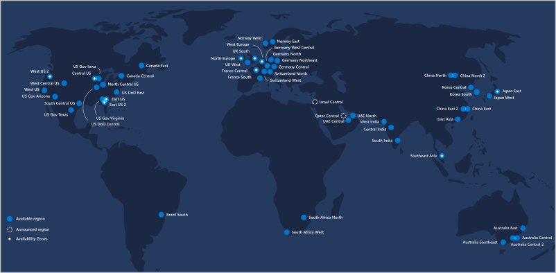
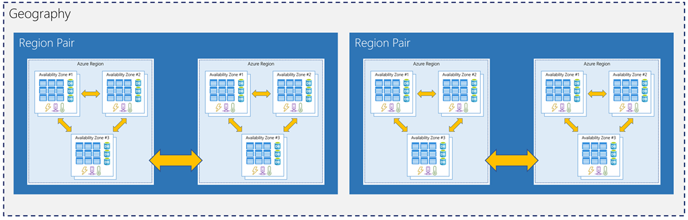
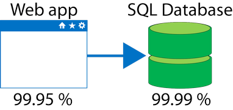

# Core Cloud Services - Azure architecture and service guarantees

## Intro[^1]
Microsoft Azure provides a reliable, redundant, energy-efficient infrastructure that spans more than 100 highly secure facilities worldwide, linked by one of the largest networks on earth. Azure allows you to gain global reach with local presence, keep your data secure and compliant with local laws, and have a reduced creatingbon footprint with Microsoft's environment-friendly datacenters.

## What is a region?[^2]

A region is a geographical area on the planet containing at least one, but potentially multiple datacenters that are nearby and networked together with a low-latency network. Azure intelligently assigns and controls the resources within each region to ensure workloads are appropriately balanced.

- Azure has more global regions than any other cloud provider
- Special Azure regions

## Understand Geographies in Azure[^3]

Azure divides the world into geographies that are defined by geopolitical boundaries or country borders. An Azure geography is a discrete market typically containing two or more regions that preserve data residency and compliance boundaries. This division has several benefits.

Geographies are broken up into the following areas:

- Americas
- Europe
- Asia Pacific
- Middle East and Africa

## Understand Availability Zones in Azure[^4]

You want to ensure your services and data are redundant so you can protect your information in case of failure. When you are hosting your infrastructure, this requires creating duplicate hardware environments. Azure can help make your app highly available through Availability Zones.

### What is an Availability Zone?

Availability Zones are physically separate datacenters within an Azure region.

#### Supported regions**

Not every region has support for Availability Zones. The following regions have a minimum of three separate zones to ensure resiliency.

- Central US
- East US 2
- West US 2
- West Europe
- France Central
- North Europe
- Southeast Asia

** It`s expanding

#### Types 

- __Zonal services__: you pin the resource to a specific zone (for example, virtual machines, managed disks, IP addresses)
- __Zone-redundant services__: platform replicates automatically across zones (for example, zone-redundant storage, SQL Database).

## Understand Region Pairs in Azure[^5]

Availability zones are created using one or more datacenters, and there is a minimum of three zones within a single region. However, it's possible that a large enough disaster could cause an outage large enough to affect even two datacenters. That's why Azure also creates region pairs.

### What is a region pair?

Each Azure region is always paired with another region within the same geography (such as US, Europe, or Asia) at least __300 miles__ away. 

Examples of region pairs in Azure are West US paired with East US, and SouthEast Asia paired with East Asia.

## Understand Service-Level Agreements for Azure[^6]

Microsoft maintains its commitment to providing customers with high-quality products and services by adhering to comprehensive operational policies, standards, and practices. Formal documents called Service-Level Agreements (SLAs) capture the specific terms that define the performance standards that apply to Azure.

__Azure do not provide SLA for free products or shared Tiers__

### SLAs for Azure products and services

There are three key characteristics of SLAs for Azure products and services:

1. Performance Targets
2. Uptime and Connectivity Guarantees
3. Service credits

#### Performance Targets

An SLA defines performance targets for an Azure product or service. The performance targets that an SLA defines are specific to each Azure product and service. For example, performance targets for some Azure services are expressed as uptime guarantees or connectivity rates.

#### Uptime and Connectivity Guarantees

The following table lists the potential cumulative downtime for various SLA levels over different durations:

|  SLA % | Downtime per week | Downtime per month | Downtime per year |
|:------:|:-----------------:|:------------------:|:-----------------:|
| 99     | 1.68 hours        | 7.2 hours          | 3.65 days         |
| 99.9   | 10.1 minutes      | 43.2 minutes       | 8.76 hours        |
| 99.95  | 5 minutes         | 21.6 minutes       | 4.38 hours        |
| 99.99  | 1.01 minutes      | 4.32 minutes       | 52.56 minutes     |
| 99.999 | 6 seconds         | 25.9 seconds       | 5.26 minutes      |

#### Service Credits

SLAs also describe how Microsoft will respond if an Azure product or service fails to perform to its governing SLA's specification.

The first column in the table below shows monthly uptime percentage SLA targets for a single instance Azure Virtual Machine. The second column shows the corresponding service credit amount you receive if the actual uptime is less than the specified SLA target for that month.

| MONTHLY UPTIME PERCENTAGE | SERVICE CREDIT PERCENTAGE |
|:-------------------------:|:-------------------------:|
| < 99.9                    | 10                        |
| < 99                      | 25                        |
| < 95                      | 100                       |

## Compose SLAs across services[^7]

When combining SLAs across different service offerings, the resultant SLA is called a Composite SLA. The resulting composite SLA can provide higher or lower uptime values, depending on your application architecture.

### Calculating downtime

Consider an App Service web app that writes to Azure SQL Database. These Azure services currently have the following SLAs:

    99.95 percent × 99.99 percent = 99.94 percent

This means the combined probability of failure is higher than the individual SLA values. This isn't surprising, because an application that relies on multiple services has more potential failure points.

Conversely, you can improve the composite SLA by creating independent fallback paths. For example, if the SQL Database is unavailable, you can put transactions into a queue for processing at a later time.

If the expected percentage of time for a simultaneous failure is 0.0001 × 0.001, the composite SLA for this combined path of a database or queue would be:

    1.0 − (0.0001 × 0.001) = 99.99999 percent

Therefore, if we add the queue to our web app, the total composite SLA is:

    99.95 percent × 99.99999 percent = ~99.95 percent

Notice we've improved our SLA behavior. However, there are trade-offs to using this approach: the application logic is more complicated, you are paying more to add the queue support, and there may be data-consistency issues you'll have to deal with due to retry behavior.

## Improve your app reliability in Azure[^8]

You can use SLAs to evaluate how your Azure solutions meet business requirements and the needs of your clients and users. By creating your own SLAs, you can set performance targets to suit your specific Azure application. This approach is known as an Application SLA.

### Resiliency

Resiliency is the ability of a system to recover from failures and continue to function. It's not about avoiding failures, but responding to failures in a way that avoids downtime or data loss. The goal of resiliency is to return the application to a fully functioning state following a failure. High availability and disaster recovery are two crucial components of resiliency.

### Cost and complexity vs. high availability

Availability refers to the time that a system is functional and working. Maximizing availability requires implementing measures to prevent possible service failures. However, devising preventative measures can be difficult and expensive, and often results in complex solutions.

For example: A workload that requires 99.99 percent uptime shouldn't depend upon a service with a 99.9 percent SLA.

[^1]: https://docs.microsoft.com/en-us/learn/modules/explore-azure-infrastructure/1-introduction
[^2]: https://docs.microsoft.com/en-us/learn/modules/explore-azure-infrastructure/2-azure-datacenter-locations
[^3]: https://docs.microsoft.com/en-us/learn/modules/explore-azure-infrastructure/3-geographies
[^4]: https://docs.microsoft.com/en-us/learn/modules/explore-azure-infrastructure/4-availability-zones
[^5]: https://docs.microsoft.com/en-us/learn/modules/explore-azure-infrastructure/5-region-pairs
[^6]: https://docs.microsoft.com/en-us/learn/modules/explore-azure-infrastructure/6-service-level-agreements
[^7]: https://docs.microsoft.com/en-us/learn/modules/explore-azure-infrastructure/7-composite-sla
[^8]: https://docs.microsoft.com/en-us/learn/modules/explore-azure-infrastructure/8-improve-app-slas