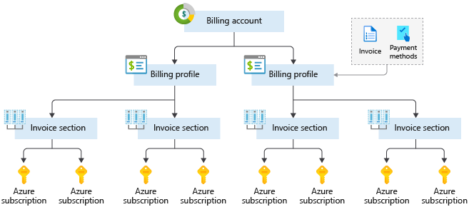

# 2 - Create an Azure account
[< Previous](1-Cloud-Concepts-Principles-of-cloud-computing.md) - [Next >](3-Core-Cloud-Services-Introduction-to-Azure.md)
## Intro[^1]

To create and use Azure services, you need an Azure subscription. When you sign up, an Azure subscription is created for you. It allows you to build and deploy cloud-based applications, use sophisticated artificial intelligence services, and extract essential insights from your data.

## Create an Azure account[^2]

You can purchase Azure access directly from Microsoft by signing up on the Azure website or through a Microsoft representative. You can also purchase Azure access through a Microsoft partner. Cloud Solution Provider partners offer a range of complete managed cloud solutions for Azure.

## Understand Azure billing[^3]

With Azure, you only pay for what you use. You'll receive a monthly invoice with payment instructions provided. You may organize your invoice into line items that make sense to you and meet your budget and cost tracking needs. You also can get set up for multiple invoices. Let's take a look at how this works.

### Azure subscription

When you sign up, an Azure subscription is created by default. An Azure subscription is a logical container used to provision resources in Azure. It holds the details of all your resources like virtual machines (VMs), databases, and more. When you create an Azure resource like a VM, you identify the subscription it belongs to. As you use the VM, the usage of the VM is aggregated and billed monthly.

### Create additional Azure subscriptions

You might want to create additional subscriptions for resource or billing management purposes. For example, you might choose to create additional subscriptions to separate:

- __Environments__
- __Organizational structures__
- __Billing__
- __Subscription limits__

### Customize billing to meet your needs

## Azure support options[^4]

### Azure support plans

|                             |        Developer        |              Standard              |                  Professional Direct                  |
|:---------------------------:|:-----------------------:|:----------------------------------:|:-----------------------------------------------------:|
| Best for                    | Non-critical workloads  | Production workloads               | Business-critical workloads                           |
| Reactive technical support  | 1 business day response | 1-hour response for critical cases | 1-hour response + priority tracking of critical cases |
| Proactive technical support | Not applicable          | Not applicable                     | Access to a pool of technical experts                 |

### Azure community support

|          Channel         |`   `                                               Description                                              |
|:------------------------:|:------------------------------------------------------------------------------------------------------:|
| Azure Knowledge Center   | The Azure Knowledge Center is a searchable database that contains answers to common support questions. |
| Microsoft Tech Community | Get support by reading responses to Azure technical questions from Microsoft's developers and testers. |
| Stack Overflow           | You can review answers to questions from the development community.                                    |
| Server Fault             | Review community responses to questions about System and Network Administration in Azure.              |
| Azure Feedback Forums    | Read ideas and suggestions for improving Azure made by Azure users.                                    |
| Twitter                  | Tweet @AzureSupport to get answers and support from the official Microsoft Azure Twitter channel.      |

[< Previous](1-Cloud-Concepts-Principles-of-cloud-computing.md) - [Next >](3-Core-Cloud-Services-Introduction-to-Azure.md)

[^1]: https://docs.microsoft.com/en-us/learn/modules/create-an-azure-account/1-introduction
[^2]: https://docs.microsoft.com/en-us/learn/modules/create-an-azure-account/2-azure-accounts-and-subscriptions
[^3]: https://docs.microsoft.com/en-us/learn/modules/create-an-azure-account/4-multiple-subscriptions
[^4]: https://docs.microsoft.com/en-us/learn/modules/create-an-azure-account/5-support-options