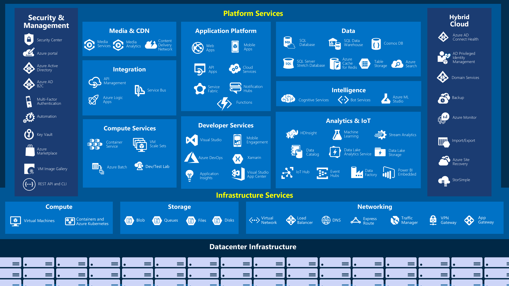

[< Previous](2-Create-an-Azure-account.md) - [Next >](4-Core-Cloud-Services-Azure-architecture-and-service-gu.md)
# 3 - Core Cloud Services - Introduction to Azure
## Intro[^1]

Did you know that more than 90% of Fortune 500 companies run on the Microsoft Cloud?

## What is Azure?[^2]

Video (2:39) _How does Azure work?_ - https://www.microsoft.com/en-us/videoplayer/embed/RWlzQ6

### What is cloud computing?

Cloud computing is the delivery of computing services over the Internet using a pay-as-you-go pricing model. Put another way; it's a way to rent compute power and storage from someone else's data center.

### Why should I move to the cloud?

In our ever-changing digital world, two trends emerge:

- Teams are delivering new features to their users at record speeds.
- End users expect an increasingly rich and immersive experience with their devices and with software.

Software releases were once scheduled in terms of months or even years. Today, teams are releasing features in smaller batches. Releases are now often scheduled in terms of days or weeks. Some teams even deliver software updates continuously—sometimes with multiple releases within the same day.

### What can I do on Azure?

Azure provides over 100 services that enable you to do everything from running your existing applications on virtual machines to exploring new software paradigms such as intelligent bots and mixed reality.

For example, Azure provides AI and machine-learning services that can naturally communicate with your users through vision, hearing, and speech. It also provides storage solutions that dynamically grow to accommodate massive amounts of data. Azure services enable solutions that are not feasible without the power of the cloud.

## Tour of Azure services[^3]

### Azure Services



Let's take a closer look at the most commonly used categories:

- Compute
- Networking
- Storage
- Mobile
- Databases
- Web
- Internet of Things
- Big Data
- Artificial Intelligence
- DevOps

## Exercices

### Azure Cloud Shell?

Azure Cloud Shell is a browser-based command-line experience for managing and developing Azure resources. Think of Cloud Shell as an interactive console that you run in the cloud.

```
#Get Account
az account list --output table

#Get group
az group list --output table

#Get Resource list
az resource list \
    --resource-group learn-1545eb5d-bd5d-4158-8d70-dbe2c21750a6 \
    --resource-type Microsoft.Web/sites
```

```JSON
[
  {
    "changedTime": null,
    "createdTime": null,
    "id": "/subscriptions/5c880e39-4cae-4924-81f6-d3bb8661ba69/resourceGroups/learn-1545eb5d-bd5d-4158-8d70-dbe2c21750a6/providers/Microsoft.Web/sites/luchipress",
    "identity": null,
    "kind": "app",
    "location": "centralus",
    "managedBy": null,
    "name": "luchipress",
    "plan": null,
    "properties": null,
    "provisioningState": null,
    "resourceGroup": "learn-1545eb5d-bd5d-4158-8d70-dbe2c21750a6",
    "sku": null,
    "tags": null,
    "type": "Microsoft.Web/sites"
  }
]
```

```
#stop app
az webapp stop \
    --resource-group learn-1545eb5d-bd5d-4158-8d70-dbe2c21750a6 \
    --name luchipress
#start app
az webapp start \
    --resource-group learn-1545eb5d-bd5d-4158-8d70-dbe2c21750a6 \
    --name luchipress
```

[< Previous](2-Create-an-Azure-account.md) - [Next >](4-Core-Cloud-Services-Azure-architecture-and-service-gu.md)

[^1]: https://docs.microsoft.com/en-us/learn/modules/welcome-to-azure/1-introduction
[^2]: https://docs.microsoft.com/en-us/learn/modules/welcome-to-azure/2-what-is-azure
[^3]: https://docs.microsoft.com/en-us/learn/modules/welcome-to-azure/3-tour-of-azure-services