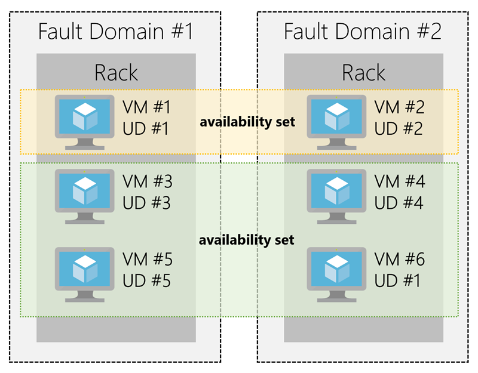

# 6 - Core Cloud Services - Azure compute options
[< Previous](5-Core-Cloud-Services-Manage-services-with-the-Azure-po.md) - [Next >](7-Core-Cloud-Services-Azure-data-storage-options.md)
## Intro[^1]

We can create compute resources, configure them to do the work we need, and pay only for what we use.

## Essential Azure compute concepts[^2]

Azure compute is an on-demand computing service for running cloud-based applications. It provides computing resources like multi-core processors and supercomputers via virtual machines and containers. It also provides serverless computing to run apps without requiring infrastructure setup or configuration. The resources are available on-demand and can typically be created in minutes or even seconds. You pay only for the resources you use and only for as long as you're using them.

There are four common techniques for performing compute in Azure:

- Virtual machines
- Containers
- Azure App Service
- Serverless computing

## Explore Azure Virtual Machines[^3]

Azure Virtual Machines (VMs) let you create and use virtual machines in the cloud. They provide infrastructure as a service (IaaS) in the form of a virtualized server and can be used in many ways. Just like a physical computer, you can customize all of the software running on the VM. VMs are an ideal choice when you need:

- Total control over the operating system (OS)
- The ability to run custom software, or
- To use custom hosting configurations
- Lift and Shift

### Scaling VMs in Azure

You can run single VMs for testing, development, or minor tasks; or you can group VMs together to provide high availability, scalability, and redundancy. Azure has several features such that, no matter what your uptime requirements are, Azure can meet them. These features include:

- Availability sets
- Virtual Machine Scale Sets
- Azure Batch

#### What are availability sets?

An __availability set__ is a logical grouping of two or more VMs that help keep your application available during planned or unplanned maintenance.

A _planned maintenance_ event is when the underlying Azure fabric that hosts VMs is updated by Microsoft. _Update domains_ indicate groups of VMs and underlying physical hardware that can be rebooted at the same time. Update domains are a logical part of each data center and are implemented with software and logic.

_Unplanned maintenance_ events involve a hardware failure in the data center, such as a power outage or disk failure.The group of virtual machines that share common hardware are in the same _fault domain_.

With an availability set, you get:

- Up to three fault domains that each have a server rack with dedicated power and network resources
- Five logical update domains which then can be increased to a maximum of 20

Your VMs are then sequentially placed across the fault and update domains. The following diagram shows an example where you have six VMs in two availability sets distributed across the two fault domains and five update domains.

There's no cost for an availability set. You only pay for the VMs within the availability set. We highly recommend that you place each workload in an availability set to avoid having a single point of failure in your VM architecture.

#### What are virtual machine scale sets?

Azure Virtual Machine Scale Sets let you create and manage a group of identical, load balanced VMs. Imagine you're running a website that enables scientists to upload astronomy images that need to be processed. If you duplicated the VM, you'd normally need to configure an additional service to route requests between multiple instances of the website. Virtual Machine Scale Sets could do that work for you.

#### What is Azure Batch?

Azure Batch enables large-scale job scheduling and compute management with the ability to scale to tens, hundreds, or thousands of VMs.

When you're ready to run a job, Batch does the following:

- Starts a pool of compute VMs for you
- Installs applications and staging data
- Runs jobs with as many tasks as you have
- Identifies failures
- Requeues work
- Scales down the pool as work completes

## Explore Containers in Azure[^4]

If you wish to run multiple instances of an application on a single host machine, containers are an excellent choice. The container orchestrator can start, stop, and scale out application instances as needed.

A container is a modified runtime environment built on top of a host OS that executes your application. A container doesn't use virtualization, so it doesn't waste resources simulating virtual hardware with a redundant OS. This environment typically makes containers more lightweight than VMs. This design allows you to respond quickly to changes in demand or failure. Another benefit of containers is you can run multiple isolated applications on a single container host. Since containers are secured and isolated, you don't need separate servers for each app.

### Containers in Azure

Azure supports Docker containers (a standardized container model), and there are several ways to manage containers in Azure.

- Azure Container Instances (ACI)
- Azure Kubernetes Service (AKS)

#### Azure Container Instances

Azure Container Instances (ACI) offers the fastest and simplest way to run a container in Azure. You don't have to manage any virtual machines or configure any additional services. It is a PaaS offering that allows you to upload your containers and execute them directly with automatic elastic scale.

#### Azure Kubernetes Service

The task of automating, managing, and interacting with a large number of containers is known as orchestration. Azure Kubernetes Service (AKS) is a complete orchestration service for containers with distributed architectures with multiple containers.

### Using containers in your solutions

Containers are often used to create solutions using a microservice architecture. This architecture is where you break solutions into smaller, independent pieces. For example, you may split a website into a container hosting your front end, another hosting your back end, and a third for storage. This split allows you to separate portions of your app into logical sections that can be maintained, scaled, or updated independently.

#### What is a microservice?

Imagine your website backend has reached capacity but the front end and storage aren't being stressed. You could scale the back end separately to improve performance, or you could decide to use a different storage service. Or you could even replace the storage container without affecting the rest of the application.

### Migrating apps to containers

You can move existing applications to containers and run them within AKS. You can control access via integration with Azure Active Directory (Azure AD) and access Service Level Agreement (SLA)–backed Azure services, such as Azure Database for MySQL for any data needs, via Open Service Broker for Azure (OSBA).

## Explore Azure App Services[^5]

Azure App Service enables you to build and host web apps, background jobs, mobile backends, and RESTful APIs in the programming language of your choice without managing infrastructure. It offers automatic scaling and high availability. App Service supports both Windows and Linux, and enables automated deployments from GitHub, Azure DevOps, or any Git repo to support a continuous deployment model.

### App Service costs

You pay for the Azure compute resources your app uses while it processes requests based on the App Service Plan you choose. The App Service plan determines how much hardware is devoted to your host - for example, whether it's dedicated or shared hardware, and how much memory is reserved for it. There is even a free tier you can use to host small, low-traffic sites.

### Types of app services

With Azure App Service, you can host most common app service styles, including:

- Web Apps
- API Apps
- WebJobs
- Mobile Apps

## Explore Serverless computing in Azure[^6]

Serverless computing is the abstraction of servers, infrastructure, and OSs. With serverless computing, Azure takes care of managing the server infrastructure and allocation/deallocation of resources based on demand. Infrastructure isn't your responsibility. Scaling and performance are handled automatically, and you are billed only for the exact resources you use. There's no need to even reserve capacity.

- Abstraction of servers
- Event-driven scale
- Micro-billing

Azure has two implementations of serverless compute:

- _Azure Functions_, which can execute code in almost any modern language.
- _Azure Logic Apps_, which are designed in a web-based designer and can execute logic triggered by Azure services without writing any code.

### Azure Functions

When you're concerned only about the code running your service, and not the underlying platform or infrastructure, Azure Functions are ideal. They're commonly used when you need to perform work in response to an event, often via a REST request, timer, or message from another Azure service and when that work can be completed quickly, within seconds or less.

Azure Functions scale automatically based on demand, so they're a solid choice when demand is variable. For example, you may be receiving messages from an IoT solution used to monitor a fleet of delivery vehicles. You'll likely have more data arriving during business hours.

Furthermore, Azure Functions can be either stateless (the default), where they behave as if they're restarted every time they respond to an event, or stateful (called "Durable Functions"), where a context is passed through the function to track prior activity.

### Azure Logic Apps

Azure Logic Apps are similar to Functions - both enable you to trigger logic based on an event. Where Functions execute code, Logic Apps execute workflows designed to automate business scenarios and built from predefined logic blocks. 

###  Functions vs. Logic Apps

|         -         |                               Functions                               |                                               Logic Apps                                               |
|:-----------------:|:---------------------------------------------------------------------:|:------------------------------------------------------------------------------------------------------:|
| State             | Normally stateless, but Durable Functions provide state               | Stateful                                                                                               |
| Development       | Code-first (imperative)                                               | Designer-first (declarative)                                                                           |
| Connectivity      | About a dozen built-in binding types, write code for custom bindings  | Large collection of connectors, Enterprise Integration Pack for B2B scenarios, build custom connectors |
| Actions           | Each activity is an Azure function; write code for activity functions | Large collection of ready-made actions                                                                 |
| Monitoring        | Azure Application Insights                                            | Azure portal, Log Analytics                                                                            |
| Management        | REST API, Visual Studio                                               | Azure portal, REST API, PowerShell, Visual Studio                                                      |
| Execution context | Can run locally or in the cloud                                       | Runs only in the cloud.                                                                                |

[< Previous](5-Core-Cloud-Services-Manage-services-with-the-Azure-po.md) - [Next >](7-Core-Cloud-Services-Azure-data-storage-options.md)

[^1]: https://docs.microsoft.com/en-us/learn/modules/intro-to-azure-compute/1-introduction
[^2]: https://docs.microsoft.com/en-us/learn/modules/intro-to-azure-compute/2-essential-azure-compute-concepts
[^3]: https://docs.microsoft.com/en-us/learn/modules/intro-to-azure-compute/3-virtual-machines
[^4]: https://docs.microsoft.com/en-us/learn/modules/intro-to-azure-compute/4-containers
[^5]: https://docs.microsoft.com/en-us/learn/modules/intro-to-azure-compute/5-appservice
[^6]: https://docs.microsoft.com/en-us/learn/modules/intro-to-azure-compute/6-serverless-computing