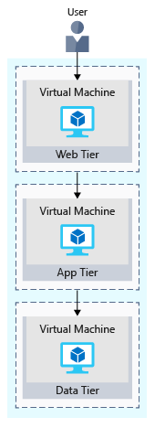
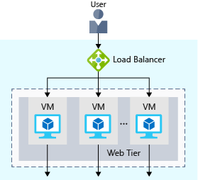
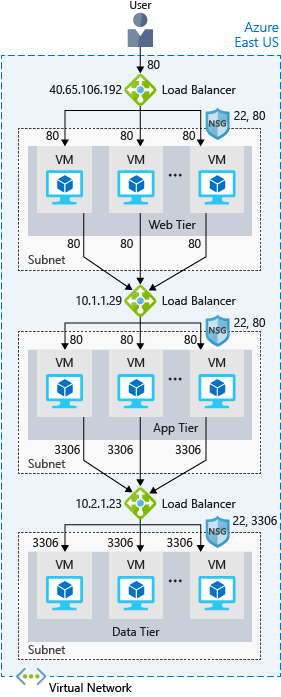
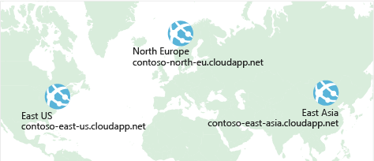

[< Previous](7-Core-Cloud-Services-Azure-data-storage-options.md) - [Next >]()
# 8 - Core Cloud Services - Azure networking options

Running your app or service in the cloud requires a fast and secure network. Learn some of the Azure networking basics and how Azure networking helps improve resiliency and reduce latency.

## Intro[^1]

As it turns out, managing networks on Azure isn't entirely different from managing on-premises networks. Let's discover why.

## Deploy your site to Azure[^2]

Your first step will likely be to re-create your on-premises configuration in the cloud.

### Your e-commerce site at a glance

Larger enterprise systems are often composed of multiple inter-connected applications and services that work together. You might have a front-end web system that displays inventory and allows customers to create an order. That might talk to a variety of web services to provide the inventory data, manage user profiles, process credit cards, and request fulfillment of processed orders.

There are several strategies and patterns employed by software architects and designers to make these complex systems easier to design, build, manage, and maintain. Let's look at a few of them, starting with loosely coupled architectures.

### Benefits of Loosely Coupled Architectures

Video (2:34) _Benefits of Loosely Coupled Architectures?_ - https://www.microsoft.com/en-us/videoplayer/embed/RE2yHrc

### Using an N-tier architecture

An architectural pattern that can be used to build loosely coupled systems is N-tier.

An N-tier architecture divides an application into two or more logical tiers. Architecturally, a higher tier can access services from a lower tier, but a lower tier should never access a higher tier.

Three-tier refers to an n-tier application that has three tiers. Your e-commerce web application follows this three-tier architecture:

- The _web tier_ provides the web interface to your users through a browser.
- The _application tier_ runs business logic.
- The _data tier_ includes databases and other storage that hold product information and customer orders.

The following illustration shows the flow of a request from the user to the data tier.

### Your e-commerce site running on Azure

Azure provides many different ways to host your web applications, from fully pre-configured environments that host your code, to virtual machines that you configure, customize, and manage.

Let's say you choose to run your e-commerce site on virtual machines. Here's what that might look like in your test environment running on Azure. The following illustration shows a three-tier architecture running on virtual machines with security features enabled to restrict inbound requests.

Let's break this down.

#### What's an Azure region?

A region is one or more Azure data centers within a specific geographic location. East US, West US, and North Europe are examples of regions. In this instance, you see that the application is running in the East US region.

#### What's a virtual network?

A virtual network is a logically isolated network on Azure. Azure virtual networks will be familiar to you if you've set up networks on Hyper-V, VMware, or even on other public clouds. A virtual network allows Azure resources to securely communicate with each other, the internet, and on-premises networks. A virtual network is scoped to a single region; however, multiple virtual networks from different regions can be connected together using virtual network peering.

#### What's a network security group?

A network security group, or NSG, allows or denies inbound network traffic to your Azure resources. Think of a network security group as a cloud-level firewall for your network.

For example, notice that the VM in the web tier allows inbound traffic on ports 22 (SSH) and 80 (HTTP). This VM's network security group allows inbound traffic over these ports from all sources. You can configure a network security group to accept traffic only from known sources, such as IP addresses that you trust.

### Summary

Your three-tier application is now running on Azure in the East US region. A region is one or more Azure data centers within a specific geographic location.

Each tier can access services only from a lower tier. The VM running in the web tier has a public IP address because it receives traffic from the internet. The VMs in the lower tiers, the application and data tiers, each have private IP addresses because they don't communicate directly over the internet.

Virtual networks enable you to group and isolate related systems. You define network security groups to control what traffic can flow through a virtual network.

## Scale with Azure Load Balancer[^3]

You now have your site up and running on Azure. But how can you help ensure your site is running 24/7?

### What are availability and high availability?

Availability refers to how long your service is up and running without interruption. High availability, or highly available, refers to a service that's up and running for a long period of time.

### What is resiliency?

Resiliency refers to a system's ability to stay operational during abnormal conditions.

### What is a load balancer?

A load balancer distributes traffic evenly among each system in a pool. A load balancer can help you achieve both high availability and resiliency.

The following illustration shows the role of a load balancer.

The load balancer receives the user's request and directs the request to one of the VMs in the web tier. If a VM is unavailable or stops responding, the load balancer stops sending traffic to it. The load balancer then directs traffic to one of the responsive servers.

Load balancing enables you to run maintenance tasks without interrupting service. For example, you can stagger the maintenance window for each VM. During the maintenance window, the load balancer detects that the VM is unresponsive, and directs traffic to other VMs in the pool.

### What is Azure Load Balancer?

Azure Load Balancer is a load balancer service that Microsoft provides that helps take care of the maintenance for you. Load Balancer supports inbound and outbound scenarios, provides low latency and high throughput, and scales up to millions of flows for all Transmission Control Protocol (TCP) and User Datagram Protocol (UDP) applications. You can use Load Balancer with incoming internet traffic, internal traffic across Azure services, port forwarding for specific traffic, or outbound connectivity for VMs in your virtual network.

When you manually configure typical load balancer software on a virtual machine, there's a downside: you now have an additional system that you need to maintain. If your load balancer goes down or needs routine maintenance, you're back to your original problem.

If instead, however, you use Azure Load Balancer, there's no infrastructure or software for you to maintain. You define the forwarding rules based on the source IP and port to a set of destination IP/ports.

The following illustration shows the role of Azure load balancers in a multi-tier architecture.

### Azure Application Gateway

If all your traffic is HTTP, a potentially better option is to use Azure Application Gateway. Application Gateway is a load balancer designed for web applications. It uses Azure Load Balancer at the transport level (TCP) and applies sophisticated URL-based routing rules to support several advanced scenarios.

This type of routing is known as application layer (OSI layer 7) load balancing since it understands the structure of the HTTP message.

Here are some of the benefits of using Azure Application Gateway over a simple load balancer:

- __Cookie affinity__. Useful when you want to keep a user session on the same backend server.
- __SSL termination__. Application Gateway can manage your SSL certificates and pass unencrypted traffic to the backend servers to avoid encryption/decryption overhead. It also supports full end-to-end encryption for applications that require that.
- __Web application firewall__. Application gateway supports a sophisticated firewall (WAF) with detailed monitoring and logging to detect malicious attacks against your network infrastructure.
- __URL rule-based routes__. Application Gateway allows you to route traffic based on URL patterns, source IP address and port to destination IP address and port. This is helpful when setting up a content delivery network.
- __Rewrite HTTP headers__. You can add or remove information from the inbound and outbound HTTP headers of each request to enable important security scenarios, or scrub sensitive information such as server names.

### What is a Content Delivery Network? 

A content delivery network (CDN) is a distributed network of servers that can efficiently deliver web content to users. It is a way to get content to users in their local region to minimize latency. CDN can be hosted in Azure or any other location. You can cache content at strategically placed physical nodes across the world and provide better performance to end users. Typical usage scenarios include web applications containing multimedia content, a product launch event in a particular region, or any event where you expect a high-bandwidth requirement in a region. 

### What about DNS?

DNS, or Domain Name System, is a way to map user-friendly names to their IP addresses. You can think of DNS as the phonebook of the internet.

### Summary

With load balancing in place, your e-commerce site is now more highly available and resilient. When you perform maintenance or receive an uptick in traffic, your load balancer can distribute traffic to another available system.

Although you can configure your own load balancer on a VM, Azure Load Balancer reduces upkeep because there's no infrastructure or software to maintain.

DNS maps user-friendly names to their IP addresses, much like how a phonebook maps names of people or businesses to phone numbers. You can bring your own DNS server, or use Azure DNS.

## Reduce latency with Azure Traffic Manager[^4]

Previously, you saw how Azure Load Balancer helps you achieve high availability and minimize downtime.

Although your e-commerce site is more highly available, it doesn't solve the issue of latency or create resiliency across geographic regions.

How can you make your site, which is located in the United States, load faster for users located in Europe or Asia?

### What is network latency?

Latency refers to the time it takes for data to travel over the network. Latency is typically measured in milliseconds.

Compare latency to bandwidth. Bandwidth refers to the amount of data that can fit on the connection. Latency refers to the time it takes for that data to reach its destination.

Factors such as the type of connection you use and how your application is designed can affect latency. But perhaps the biggest factor is distance.

### Scale out to different regions

Recall that Azure provides data centers in regions across the globe.

Think about the cost of building a data center. Equipment costs aren't the only factor. You need to provide the power, cooling, and personnel to keep your systems running at each location. It might be prohibitively expensive to replicate your entire data center. But doing so with Azure can cost much less, because Azure already has the equipment and personnel in place.

One way to reduce latency is to provide exact copies of your service in more than one region. The following illustration shows an example of global deployment.

-

### Use Traffic Manager to route users to the closest endpoint

One answer is Azure Traffic Manager. Traffic Manager uses the DNS server that's closest to the user to direct user traffic to a globally distributed endpoint.

### Compare Load Balancer to Traffic Manager

Azure Load Balancer distributes traffic within the same region to make your services more highly available and resilient. Traffic Manager works at the DNS level, and directs the client to a preferred endpoint. This endpoint can be to the region that's closest to your user.

Load Balancer and Traffic Manager both help make your services more resilient, but in slightly different ways. When Load Balancer detects an unresponsive VM, it directs traffic to other VMs in the pool. Traffic Manager monitors the health of your endpoints. When Traffic Manager finds an unresponsive endpoint, it directs traffic to the next closest endpoint that is responsive.

[< Previous](7-Core-Cloud-Services-Azure-data-storage-options.md) - [Next >]()

[^1]: https://docs.microsoft.com/en-us/learn/modules/intro-to-azure-networking/1-introduction
[^2]: https://docs.microsoft.com/en-us/learn/modules/intro-to-azure-networking/2-deploy-to-azure
[^3]: https://docs.microsoft.com/en-us/learn/modules/intro-to-azure-networking/3-scale-load-balancer
[^4]: https://docs.microsoft.com/en-us/learn/modules/intro-to-azure-networking/4-reduce-latency-traffic-manager