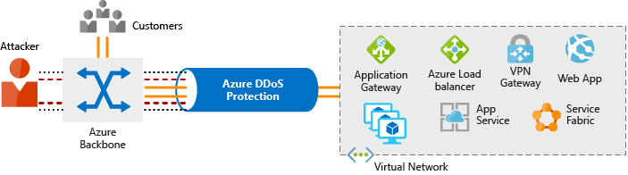

[< Previous](8-Core-Cloud-Services-Azure-networking-options.md) - [Next >](10-Apply-and-monitor-infrastructure-standards.md)
# 9 - Security, responsibility, and trust in Azure

Discuss the basic concepts for protecting your infrastructure and data when you work in the cloud. Understand what responsibilities are yours and what Azure takes care of for you.

## Intro [^1]

Every system, architecture, and application needs to be designed with security in mind. There's too much at risk. For instance, a denial of service attack could prevent your customer from reaching your web site or services and block you from doing business. Defacement of your website damages your reputation. And a data breach could be even worse — as it can ruin hard-earned trust, while causing significant personal and financial harm. As administrators, developers, and IT management, we all must work to guarantee the security of our systems.

## Cloud security is a shared responsibility [^2]

As computing environments move from customer-controlled datacenters to the cloud, the responsibility of security also shifts. Security of the operational environment is now a concern shared by both cloud providers and customers. By shifting these responsibilities to a cloud service like Azure, organizations can reduce focus on activities that aren't core business competencies. Depending on the specific technology choices, some security protections will be built into the particular service, while addressing others will remain the customer's responsibility. To ensure that the proper security controls are provided, a careful evaluation of the services and technology choices becomes necessary.

Video (3:04) _Understand security threats_ - https://www.microsoft.com/en-us/videoplayer/embed/RWkotg

### Security is a shared responsibility

For all cloud deployment types, you own your data and identities. You are responsible for helping secure your data and identities, your on-premises resources, and the cloud components you control (which vary by service type).

Regardless of the deployment type, you always retain responsibility for the following items:

- Data
- Endpoints
- Accounts
- Access management

Video (2:42) _Azure security: you versus the cloud_ - https://www.microsoft.com/en-us/videoplayer/embed/RE2yEvj

### A layered approach to security

Defense in depth is a strategy that employs a series of mechanisms to slow the advance of an attack aimed at acquiring unauthorized access to information. Each layer provides protection so that if one layer is breached, a subsequent layer is already in place to prevent further exposure. Microsoft applies a layered approach to security, both in physical data centers and across Azure services. The objective of defense in depth is to protect and prevent information from being stolen by individuals who are not authorized to access it.

- Data
    + Stored in a database
    + Stored on disk inside virtual machines
    + Stored on a SaaS application such as Office 365
    + Stored in cloud storage
- Application
    + Ensure applications are secure and free of vulnerabilities.
    + Store sensitive application secrets in a secure storage medium.
    + Make security a design requirement for all application development.
- Compute
    + Secure access to virtual machines.
    + Implement endpoint protection and keep systems patched and current.
- Networking
    + Limit communication between resources.
    + Deny by default.
    + Restrict inbound internet access and limit outbound, where appropriate.
    + Implement secure connectivity to on-premises networks.
- Perimeter
    + Use distributed denial of service (DDoS) protection to filter large-scale attacks before they can cause a denial of service for end users.
    + Use perimeter firewalls to identify and alert on malicious attacks against your network.
- Identity and access
    + Control access to infrastructure and change control.
    + Use single sign-on and multi-factor authentication.
    + Audit events and changes.
- Physical security
    + Physical building security and controlling access to computing hardware within the data center is the first line of defense.

## Get tips from Azure Security Center [^3]

A great place to start when examining the security of your Azure-based solutions is Azure Security Center. Security Center is a monitoring service that provides threat protection across all of your services both in Azure.

- Provide security recommendations based on your configurations, resources, and networks.
- Monitor security settings across on-premises and cloud workloads, and automatically apply required security to new services as they come online.
- Continuously monitor all your services, and perform automatic security assessments to identify potential vulnerabilities before they can be exploited.
- Use machine learning to detect and block malware from being installed on your virtual machines and services. You can also define a list of allowed applications to ensure that only the apps you validate are allowed to execute.
- Analyze and identify potential inbound attacks, and help to investigate threats and any post-breach activity that might have occurred.
- Provide just-in-time access control for ports, reducing your attack surface by ensuring the network only allows traffic that you require.

### Available tiers

Azure Security Center is available in two tiers:

- __Free__. Available as part of your Azure subscription, this tier is limited to assessments and recommendations of Azure resources only.
- __Standard__. This tier provides a full suite of security-related services including continuous monitoring, threat detection, just-in-time access control for ports, and more.

To access the full suite of Azure Security Center services, you will need to upgrade to a Standard tier subscription. You can access the 30-day free trial from within the Azure Security Center dashboard in the Azure portal. After the 30-day trial period is over, Azure Security Center is $15 per node per month.

### Usage scenarios

You can integrate Security Center into your workflows and use it in many ways. Here are two examples.

#### Use Security Center for incident response.

#### Use Security Center recommendations to enhance security.

You can reduce the chances of a significant security event by configuring a security policy, and then implementing the recommendations provided by Azure Security Center.

## Identity and access [^4]

Network perimeters, firewalls, and physical access controls used to be the primary protection for corporate data. But network perimeters have become increasingly porous with the explosion of bring your own device (BYOD), mobile apps, and cloud applications.

Identity has become the new primary security boundary. Therefore, proper authentication and assignment of privileges is critical to maintaining control of your data.

### Authentication and authorization

Two fundamental concepts that need to be understood when talking about identity and access control are authentication and authorization. They underpin everything else that happens and occur sequentially in any identity and access process:

- _Authentication_ is the process of establishing the identity of a person or service looking to access a resource. It involves the act of challenging a party for legitimate credentials, and provides the basis for creating a security principal for identity and access control use. It establishes if they are who they say they are.

- _Authorization_ is the process of establishing what level of access an authenticated person or service has. It specifies what data they're allowed to access and what they can do with it.

### What is Azure Active Directory?

Azure AD is a cloud-based identity service. It has built in support for synchronizing with your existing on-premises Active Directory or can be used stand-alone. This means that all your applications, whether on-premises, in the cloud (including Office 365), or even mobile can share the same credentials. Administrators and developers can control access to internal and external data and applications using centralized rules and policies configured in Azure AD.

- Authentication
- Single-Sign-On (SSO)
- Application management
- Business to business (B2B) identity services
- Business-to-Customer (B2C) identity services
- Device Management

## Encryption [^5]

For most organizations, data is the most valuable and irreplaceable asset. Encryption serves as the last and strongest line of defense in a layered security strategy.

### What is encryption?

Encryption is the process of making data unreadable and unusable to unauthorized viewers. To use or read the encrypted data, it must be decrypted, which requires the use of a secret key. There are two top-level types of encryption: symmetric and asymmetric.

- _Symmetric_ encryption uses the same key to encrypt and decrypt the data. Consider a desktop password manager application. You enter your passwords and they are encrypted with your own personal key (your key is often derived from your master password). When the data needs to be retrieved, the same key is used, and the data is decrypted.

- _Asymmetric_ encryption uses a public key and private key pair. Either key can encrypt but a single key can't decrypt its own encrypted data. To decrypt, you need the paired key. Asymmetric encryption is used for things like Transport Layer Security (TLS) (used in HTTPS) and data signing.

Both symmetric and asymmetric encryption play a role in properly securing your data. Encryption is typically approached in two ways:

- Encryption at rest
- Encryption in transit

### Encryption at rest

Data at rest is the data that has been stored on a physical medium. 

### Encryption in transit

Data in transit is the data actively moving from one location to another, such as across the internet or through a private network. Secure transfer can be handled by several different layers. It could be done by encrypting the data at the application layer prior to sending it over a network. HTTPS is an example of application layer in transit encryption.

### Encryption on Azure

- Encrypt raw storage
- Encrypt virtual machine disks
- Encrypt databases
- Encrypt secrets

## Overview of Azure certificates [^6]

As mentioned previously, Transport Layer Security (TLS) is the basis for encryption of website data in transit. TLS uses certificates to encrypt and decrypt data. However, these certificates have a lifecycle that requires administrator management.

### Types of certificates

Certificates are used in Azure for two primary purposes and are given a specific designation based on their intended use.

- _Service certificates_ are used for cloud services
- _Management certificates_ are used for authenticating with the management API

## Protect your network [^7]

Securing your network from attacks and unauthorized access is an important part of any architecture. Here, we'll take a look at what network security looks like, how to integrate a layered approach into your architecture, and how Azure can help you provide network security for your environment.

### A layered approach to network security

You've probably noticed that a common theme throughout this module is the emphasis of a layered approach to security. This approach is also recommended at the network layer. It's not enough to just focus on securing the network perimeter, or focusing on the network security between services inside a network. A layered approach provides multiple levels of protection, so that if an attacker gets through one layer, there are further protections in place to limit further attack.

#### Internet protection

If we start on the perimeter of the network, we're focused on limiting and eliminating attacks from the internet. We suggest first assessing the resources that are internet-facing, and to only allow inbound and outbound communication where necessary. Make sure you identify all resources that are allowing inbound network traffic of any type, and then ensure they are restricted to only the ports and protocols required. Azure Security Center is a great place to look for this information, because it will identify internet-facing resources that don't have network security groups associated with them, as well as resources that are not secured behind a firewall.

### What is a Firewall?

A firewall is a service that grants server access based on the originating IP address of each request. You create firewall rules that specify ranges of IP addresses. Only clients from these granted IP addresses will be allowed to access the server. Firewall rules, generally speaking, also include specific network protocol and port information.

- Azure Firewall
- Azure Application Gateway
- Network virtual appliances (NVAs)

### Stopping Distributed Denial of Service (DDoS) attacks

Any resource exposed on the internet is at risk of being attacked by a denial of service attack. These types of attacks attempt to overwhelm a network resource by sending so many requests that the resource becomes slow or unresponsive.

When you combine Azure DDoS Protection with application design best practices, you help provide defense against DDoS attacks. DDoS Protection leverages the scale and elasticity of Microsoft's global network to bring DDoS mitigation capacity to every Azure region. The Azure DDoS Protection service protects your Azure applications by monitoring traffic at the Azure network edge before it can impact your service's availability. Within a few minutes of attack detection, you are notified using Azure Monitor metrics.

This diagram shows network traffic flowing into Azure from both customers and an attacker. Azure DDoS protection identifies the attacker's attempt to overwhelm the network and blocks further traffic from reaching Azure services. Legitimate traffic from customers still flows into Azure without any interruption of service.

Types:

 - Basic
 - Standard

### Controlling the traffic inside your virtual network

- Virtual network security
- Network integration

## Protect your shared documents [^8]

Microsoft Azure Information Protection (sometimes referred to as AIP) is a cloud-based solution that helps organizations classify and optionally protect documents and emails by applying labels.

## Azure Advanced Threat Protection [^9]

Azure Advanced Threat Protection (Azure ATP) is a cloud-based security solution that identifies, detects, and helps you investigate advanced threats, compromised identities, and malicious insider actions directed at your organization.

Azure ATP is capable of detecting known malicious attacks and techniques, security issues, and risks against your network.

###  Azure ATP portal

Azure ATP has its own portal, through which you can monitor and respond to suspicious activity. The Azure ATP portal allows you to create your Azure ATP instance, and view the data received from Azure ATP sensors. You can also use the portal to monitor, manage, and investigate threats in your network environment. You can sign in to the Azure ATP portal at https://portal.atp.azure.com . Your user accounts must be assigned to an Azure AD security group that has access to the Azure ATP portal to be able to sign in.

## Understand Security Considerations for Application Lifecycle Management Solutions [^10]

The __Microsoft Security Development Lifecycle (SDL)__ introduces security and privacy considerations throughout all phases of the development process. It helps developers build highly secure software, address security compliance requirements, and reduce development costs. The guidance, best practices, tools, and processes in the SDL are practices used internally at Microsoft to build more secure products and services.

- Provide training
- Define security requirements
- Define metrics and compliance reporting
- Perform threat modeling
- Establish design requirements
- Define and use cryptography standards
- Manage security risks from using third-party components
- Use approved tools
- Perform Static Analysis Secruity Testing
- Perform Dynamic Analysis Security Testing
- Perform penetration testing
- Establish a standard incident response process

[< Previous](8-Core-Cloud-Services-Azure-networking-options.md) - [Next >](10-Apply-and-monitor-infrastructure-standards.md)

[^1]: https://docs.microsoft.com/en-us/learn/modules/intro-to-security-in-azure/1-introduction
[^2]: https://docs.microsoft.com/en-us/learn/modules/intro-to-security-in-azure/2-shared-responsibility
[^3]: https://docs.microsoft.com/en-us/learn/modules/intro-to-security-in-azure/2a-azure-security-center
[^4]: https://docs.microsoft.com/en-us/learn/modules/intro-to-security-in-azure/3-identity-and-access
[^5]: https://docs.microsoft.com/en-us/learn/modules/intro-to-security-in-azure/4-encryption
[^6]: https://docs.microsoft.com/en-us/learn/modules/intro-to-security-in-azure/4a-certificates
[^7]: https://docs.microsoft.com/en-us/learn/modules/intro-to-security-in-azure/5-network-security
[^8]: https://docs.microsoft.com/en-us/learn/modules/intro-to-security-in-azure/6-azure-information-protection
[^9]: https://docs.microsoft.com/en-us/learn/modules/intro-to-security-in-azure/7-advanced-threat-protection
[^10]: https://docs.microsoft.com/en-us/learn/modules/intro-to-security-in-azure/7a-microsoft-sdl